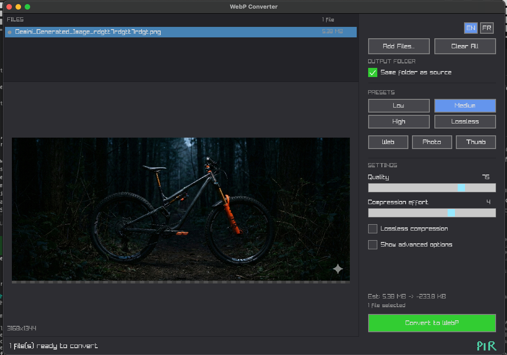

```
        ██████╗   ██╗  ██████╗
        ██╔══██╗  ██║  ██╔══██╗
        ██████╔╝  ██║  ██████╔╝
        ██╔═══╝   ██║  ██╔══██╗
        ██║       ██║  ██║  ██║
        ╚═╝       ╚═╝  ╚═╝  ╚═╝
```

# WebP Converter

A fast, native macOS application for converting images to WebP format. Built with C, raylib, and libwebp.



## Features

- Convert PNG, JPEG, BMP, and GIF images to WebP
- Batch conversion (multiple files at once)
- Drag & drop support
- Live preview with zoom
- Quality presets (Low, Medium, High, Lossless)
- Use-case presets (Web, Photo, Thumbnail)
- Advanced compression settings
- Real-time size estimation
- Multi-language support (English/French)
- Native macOS .app bundle

---

## For End Users (Download)

**No installation required!** Just download and run.

1. Download `WebPConverter-app.zip` from Releases
2. Extract the ZIP
3. **Right-click** on `WebPConverter.app` → **Open**
4. Click **Open** in the security dialog

> **Note:** Right-click → Open is required because the app isn't signed with an Apple Developer certificate. This is safe - you only need to do it once.

---

## For Developers (Building from Source)

### Prerequisites

- macOS 11.0 or later
- Xcode Command Line Tools
- [Homebrew](https://brew.sh)

### Build

```bash
# Clone the repository
git clone https://github.com/yourusername/webp_converter.git
cd webp_converter

# Install dependencies (raylib, webp)
make install-deps

# Build and run
make run
```

### Build Targets

| Command | Description |
|---------|-------------|
| `make` | Build the executable only |
| `make app` | Build the macOS .app bundle |
| `make run` | Build and launch the app |
| `make dmg` | Create a distributable DMG |
| `make clean` | Remove object files |
| `make fclean` | Remove all build artifacts |
| `make re` | Clean and rebuild |
| `make install-deps` | Install dependencies via Homebrew |

### Development Workflow

After making code changes:

```bash
# 1. Test your changes locally
make run

# 2. Create a ZIP for distribution
make app
zip -r WebPConverter-app.zip WebPConverter.app

# 3. Send the ZIP to users
#    Tell them: Extract → Right-click app → Open → Click "Open"
```

### Signed Distribution (Optional)

To create a signed and notarized DMG (requires Apple Developer Program - $99/year):

```bash
# Sign the app (requires Apple Developer ID)
make sign

# Create and notarize DMG (requires Apple Developer account)
make notarize
```

---

## Usage

### Adding Files

1. **Drag & Drop**: Drag image files directly onto the application window
2. **File Dialog**: Click "Add Files..." to open a file picker (supports multiple selection)

### Selecting Output Location

- **Same folder as source** (default): WebP files are saved alongside the originals
- **Custom folder**: Uncheck "Same folder as source" and click "Select Folder..."

### Choosing Quality Settings

#### Presets

| Preset | Quality | Best For |
|--------|---------|----------|
| **Low** | 50% | Maximum compression, smaller files |
| **Medium** | 75% | Balanced quality and size |
| **High** | 90% | High quality, larger files |
| **Lossless** | 100% | Perfect quality, no compression artifacts |
| **Web** | 80% | Optimized for web pages |
| **Photo** | 85% | Photography with high detail |
| **Thumb** | 60% | Thumbnails and previews |

#### Manual Settings

- **Quality** (0-100): Higher values = better quality, larger files
- **Compression effort** (0-6): Higher values = slower encoding, smaller files
- **Lossless compression**: Enable for pixel-perfect conversion (larger files)

#### Advanced Options

Enable "Show advanced options" to access:
- **Alpha quality**: Quality of transparent areas (0-100)
- **Filter strength**: Deblocking filter intensity (0-100)

### Converting

1. Add your files
2. Select output folder (optional)
3. Choose a preset or adjust settings manually
4. Review the size estimate at the bottom
5. Click "Convert to WebP"

A popup will display the results including:
- Number of files converted
- Total size before and after
- Space saved percentage

### Language

Click **EN** or **FR** in the top-right corner of the sidebar to switch between English and French.

---

## Project Structure

```
webp_converter/
├── src/
│   ├── main.c          # Application entry point
│   ├── ui.c/h          # User interface (raylib/raygui)
│   ├── converter.c/h   # WebP conversion logic
│   ├── presets.c/h     # Quality presets
│   └── strings.c/h     # Internationalization
├── lib/
│   ├── stb_image.h     # Image loading
│   ├── raygui.h        # GUI widgets
│   └── tinyfiledialogs # Native file dialogs
├── build/              # Build output
├── Makefile
└── README.md
```

---

## License

MIT License

## Credits

- [raylib](https://www.raylib.com/) - Graphics library
- [raygui](https://github.com/raysan5/raygui) - Immediate-mode GUI
- [libwebp](https://developers.google.com/speed/webp) - WebP encoding
- [stb_image](https://github.com/nothings/stb) - Image loading
- [tinyfiledialogs](https://sourceforge.net/projects/tinyfiledialogs/) - Native dialogs
